<!-- This file is generated using `scripts/gen-fp-doc.py`, do not edit manually. -->
<!-- markdownlint-disable MD045 MD033 -->
# LKBD Footprints

## `LKBD_Common.pretty`

| Footprint                                  | Description                                                                     | Preview                                                                                                                     |
|--------------------------------------------|---------------------------------------------------------------------------------|-----------------------------------------------------------------------------------------------------------------------------|
| `Capacitor_SMD+THT_1206_5.0x2.5mm_P5.00mm` | Dual footprint for 1206 SMD Capacitor and 5 × 2.5 mm THT Ceramic Disc Capacitor |  |
| `Capacitor_SMD_1206_inSilk`                | Capacitor SMD 1206                                                              |                 |
| `Diode_SMD+THT_SOD123_DO35_P6.5mm`         | Dual footprint for SOD123 SMD Diode and DO35 THT Diode (Pitch 6.5 mm)           |          |
| `Diode_SMD+THT_SOD123_DO35_P7.62mm`        | Dual footprint for SOD123 SMD Diode and DO35 THT Diode (Pitch 7.62 mm)          |         |
| `Diode_SMD_SOD-123_inSilk`                 | Diode SOD-123                                                                   |                  |
| `LED_SK6812MINI-E`                         | SK6812MINI-E reverse mount footprint                                            |                          |
| `LED_SK6812MINI-E_Rotated`                 | SK6812MINI-E reverse mount footprint                                            |                  |
| `Resistor_SMD_1206_inSilk`                 | Resistor SMD 1206                                                               |                  |
| `SW_Push_1P1T_6x3.5mm`                     | Tactile Push Button (6 × 3.5 mm)                                                |                      |

## `LKBD_Connector.pretty`

| Footprint                          | Description                                                      | Preview                                                                                                                |
|------------------------------------|------------------------------------------------------------------|------------------------------------------------------------------------------------------------------------------------|
| `PinHeader_1x02_THT_P2.54mm_nSilk` | Through hole straight pin header, 1x02, 2.54mm pitch, single row |  |
| `PinHeader_1x03_THT_P2.54mm_nSilk` | Through hole straight pin header, 1x03, 2.54mm pitch, single row |  |
| `PinHeader_1x04_THT_P2.54mm_nSilk` | Through hole straight pin header, 1x04, 2.54mm pitch, single row |  |
| `PinHeader_1x05_THT_P2.54mm_nSilk` | Through hole straight pin header, 1x05, 2.54mm pitch, single row |  |
| `PinHeader_1x06_THT_P2.54mm_nSilk` | Through hole straight pin header, 1x06, 2.54mm pitch, single row |  |
| `PinHeader_1x07_THT_P2.54mm_nSilk` | Through hole straight pin header, 1x07, 2.54mm pitch, single row |  |
| `PinHeader_1x08_THT_P2.54mm_nSilk` | Through hole straight pin header, 1x08, 2.54mm pitch, single row |  |

## `LKBD_KeySwitch.pretty`

| Footprint                        | Description                                                                            | Preview                                                                                                              |
|----------------------------------|----------------------------------------------------------------------------------------|----------------------------------------------------------------------------------------------------------------------|
| `ROT_EC11_SMD`                   | Generic EC11 style encoder (SMD)                                                       |                    |
| `ROT_EC11_THT`                   | ALPS EC11 style encoder (THT)                                                          | 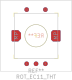                   |
| `ROT_EC11_THT_nSilk`             | ALPS EC11 style encoder (THT)                                                          | 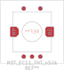             |
| `ROT_EC11_THT_sqSilk`            | ALPS EC11 style encoder (THT)                                                          | 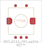            |
| `SW_MX_Choc_HotSwap`             | Dual footprint for Cherry MX style keyswitch and Choc style switches (SMD HotSwap)     | 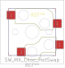             |
| `SW_MX_Choc_HotSwap_nSilk`       | Dual footprint for Cherry MX style keyswitch and Choc style switches (SMD HotSwap)     | 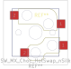       |
| `SW_MX_Choc_HotSwap_sqSilk`      | Dual footprint for Cherry MX style keyswitch and Choc style switches (SMD HotSwap)     |       |
| `SW_MX_EC11_HotSwap`             | Dual footprint for Cherry MX style keyswitch and ALPS EC11 style encoder (SMD HotSwap) | 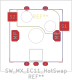             |
| `SW_MX_EC11_HotSwap_THT`         | Dual footprint for Cherry MX style keyswitch and ALPS EC11 style encoder (THT)         | 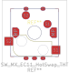         |
| `SW_MX_EC11_HotSwap_THT_nSilk`   | Dual footprint for Cherry MX style keyswitch and ALPS EC11 style encoder (THT)         | 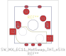   |
| `SW_MX_EC11_HotSwap_THT_sqSilk`  | Dual footprint for Cherry MX style keyswitch and ALPS EC11 style encoder (THT)         | 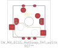  |
| `SW_MX_EC11_HotSwap_nSilk`       | Dual footprint for Cherry MX style keyswitch and ALPS EC11 style encoder (SMD HotSwap) |        |
| `SW_MX_EC11_HotSwap_sqSilk`      | Dual footprint for Cherry MX style keyswitch and ALPS EC11 style encoder (SMD HotSwap) | 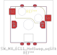      |
| `SW_MX_EC11_THT`                 | Dual footprint for Cherry MX style keyswitch and ALPS EC11 style encoder (THT)         | 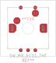                 |
| `SW_MX_EC11_THT_nSilk`           | Dual footprint for Cherry MX style keyswitch and ALPS EC11 style encoder (THT)         |            |
| `SW_MX_EC11_THT_sqSilk`          | Dual footprint for Cherry MX style keyswitch and ALPS EC11 style encoder (THT)         |           |
| `SW_MX_HotSwap`                  | Cherry MX style keyswitch (SMD HotSwap)                                                | 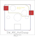                  |
| `SW_MX_HotSwap_THT`              | Cherry MX style keyswitch (SMD HotSwap + THT)                                          | 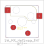              |
| `SW_MX_HotSwap_THT_nSilk`        | Cherry MX style keyswitch (SMD HotSwap + THT)                                          | 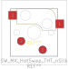        |
| `SW_MX_HotSwap_THT_sqSilk`       | Cherry MX style keyswitch (SMD HotSwap + THT)                                          | 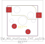       |
| `SW_MX_HotSwap_nSilk`            | Cherry MX style keyswitch (SMD HotSwap)                                                |             |
| `SW_MX_HotSwap_sqSilk`           | Cherry MX style keyswitch (SMD HotSwap)                                                | 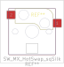           |
| `SW_MX_Reversible_HotSwap`       | Cherry MX style keyswitch (SMD HotSwap)                                                |        |
| `SW_MX_Reversible_HotSwap_nSilk` | Cherry MX style keyswitch (SMD HotSwap)                                                |  |
| `SW_MX_Slim_HotSwap`             | Cherry MX style keyswitch (SMD HotSwap, Slim Pads)                                     | 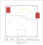             |
| `SW_MX_Slim_HotSwap_THT`         | Cherry MX style keyswitch (SMD HotSwap + THT, Slim Pads)                               | 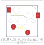         |
| `SW_MX_Slim_HotSwap_THT_nSilk`   | Cherry MX style keyswitch (SMD HotSwap + THT, Slim Pads)                               | 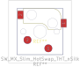   |
| `SW_MX_Slim_HotSwap_THT_sqSilk`  | Cherry MX style keyswitch (SMD HotSwap + THT, Slim Pads)                               | 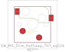  |
| `SW_MX_Slim_HotSwap_nSilk`       | Cherry MX style keyswitch (SMD HotSwap, Slim Pads)                                     | 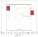       |
| `SW_MX_Slim_HotSwap_sqSilk`      | Cherry MX style keyswitch (SMD HotSwap, Slim Pads)                                     |       |
| `SW_MX_THT`                      | Cherry MX style keyswitch (THT)                                                        | 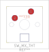                      |
| `SW_MX_THT_nSilk`                | Cherry MX style keyswitch (THT)                                                        | 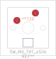                |
| `SW_MX_THT_sqSilk`               | Cherry MX style keyswitch (THT)                                                        | 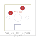               |

## `LKBD_MCU.pretty`

| Footprint                             | Description                                                             | Preview                                                                                                             |
|---------------------------------------|-------------------------------------------------------------------------|---------------------------------------------------------------------------------------------------------------------|
| `MCU_KB2040`                          | Adafryut KB2040 MCU (THT)                                               | 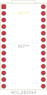                          |
| `MCU_KB2040_Reverse`                  | Adafryut KB2040 MCU (THT)                                               | 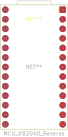                  |
| `MCU_ProMicro_DIP-24_Socket`          | DIP-24 (Wide, 15.24 mm) socket for Generic ProMicro style MCU           | 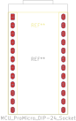          |
| `MCU_ProMicro_DIP-24_Socket_Reverse`  | DIP-24 (Wide, 15.24 mm) socket for Generic ProMicro style MCU (Reverse) |   |
| `MCU_ProMicro_Generic`                | Generic ProMicro style MCU                                              | 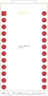                |
| `MCU_ProMicro_Generic_Reverse`        | Generic ProMicro style MCU (Reverse)                                    | 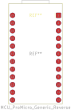        |
| `MCU_ProMicro_Generic_ZigZag`         | Generic ProMicro style MCU (ZigZag)                                     |          |
| `MCU_ProMicro_Generic_ZigZag_Reverse` | Generic ProMicro style MCU (ZigZag, Reverse)                            | 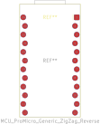 |
| `MCU_RaspberryPi_Pico_THT`            | Raspberry Pi Pico & Pico 2 (THT)                                        | 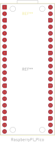            |
| `MCU_XIAO_Generic`                    | Generic Seeed Studio Style XIAO MCU (SMD + THT)                         | 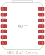                    |
| `MCU_XIAO_Generic_SMD`                | Generic Seeed Studio Style XIAO MCU (SMD)                               |                 |
| `MCU_XIAO_Generic_THT`                | Generic Seeed Studio Style XIAO MCU (THT)                               |                 |
| `MCU_XIAO_RP2040`                     | Seeed Studio XIAO RP2040 MCU (SMD + THT)                                | 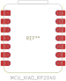                     |
| `MCU_XIAO_nRF52840`                   | Seeed Studio XIAO nRF52840 MCU (SMD + THT)                              |                    |
| `MCU_XIAO_nRF52840_BAT`               | Seeed Studio XIAO nRF52840 MCU (SMD + THT, Battery Connector)           | 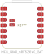               |

## `LKBD_MicroSwitch.pretty`

| Footprint     | Description                                      | Preview                                                                                             |
|---------------|--------------------------------------------------|-----------------------------------------------------------------------------------------------------|
| `SW_D2FC_OMR` | Omron D2FC Ultra Subminiature Basic Switch (THT) | 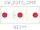 |
| `SW_D2LS_OMR` | Omron D2LS Ultra Subminiature Basic Switch (SMD) | 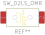 |

## `LKBD_MountingHole.pretty`

| Footprint                     | Description                                             | Preview                                                                                                              |
|-------------------------------|---------------------------------------------------------|----------------------------------------------------------------------------------------------------------------------|
| `MountingHole_M2`             | Mounting Hole M2 Screw (ø 2.2 mm, Pad 4mm)              |              |
| `MountingHole_M2Head`         | Mounting Hole M2 Head Clearance (ø 4 mm)                |          |
| `MountingHole_M2_NPTH`        | Mounting Hole M2 Screw (ø 2.2 mm, Pad 4mm)              |         |
| `MountingHole_M2_NoPad`       | Mounting Hole M2 Screw (ø 2.2 mm)                       |        |
| `MountingHole_M2_Oval`        | Mounting Hole M2 Screw (ø 2.2 × 3.6 mm, Pad 4mm)        |         |
| `MountingHole_M2_Oval_NTPH`   | Mounting Hole M2 Screw (ø 2.2 × 3.6 mm, Pad 4mm)        |    |
| `MountingHole_M2_Oval_NoPad`  | Mounting Hole M2 Screw (ø 2.2 × 3.6 mm)                 |   |
| `MountingSlot_M2`             | Mounting Slot M2 Screw (ø 2.2 × 5.2 mm, Pad 4 × 7 mm)   |              |
| `MountingSlot_M2Head`         | Mounting Slot M2 Head Clearance (ø 4 × 7 mm)            |          |
| `MountingSlot_M2Head_Small`   | Mounting Slot M2 Head Clearance (ø 4 × 5.4 mm)          |    |
| `MountingSlot_M2_NTPH`        | Mounting Slot M2 Screw (ø 2.2 × 5.2 mm, Pad 4 × 7 mm)   |         |
| `MountingSlot_M2_NoPad`       | Mounting Slot M2 Screw (ø 2.2 × 5.2 mm)                 |        |
| `MountingSlot_M2_Small`       | Mounting Slot M2 Screw (ø 2.2 × 3.6 mm, Pad 4 × 5.4 mm) |        |
| `MountingSlot_M2_Small_NPTH`  | Mounting Slot M2 Screw (ø 2.2 × 3.6 mm, Pad 4 × 5.4 mm) |   |
| `MountingSlot_M2_Small_NoPad` | Mounting Slot M2 Screw (ø 2.2 × 3.6 mm)                 |  |

## `LKBD_OLED.pretty`

| Footprint                                | Description                                                                             | Preview                                                                                                                 |
|------------------------------------------|-----------------------------------------------------------------------------------------|-------------------------------------------------------------------------------------------------------------------------|
| `OLED_Generic_128x32_64x128_I2C`         | Generic footprint for OLED I²C module (compatible with 0.91, 0.96 and 1.3 inch modules) |          |
| `OLED_Generic_128x32_64x128_I2C_nSilk`   | Generic footprint for OLED I²C module (compatible with 0.91, 0.96 and 1.3 inch modules) |    |
| `OLED_SH1107_64x128_1.3inch_I2C`         | SSD1107 based OLED module (1.3 inch)                                                    | 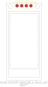         |
| `OLED_SH1107_64x128_1.3inch_I2C_nSilk`   | SSD1107 based OLED module (1.3 inch)                                                    |    |
| `OLED_SSD1107_64x128_0.96inch_I2C`       | SSD1107 based OLED module (0.96 inch)                                                   | 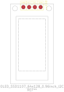       |
| `OLED_SSD1107_64x128_0.96inch_I2C_nSilk` | SSD1107 based OLED module (0.96 inch)                                                   |  |
| `OLED_SSD1306_128x32_0.91inch_I2C`       | SSD1306 based OLED module (0.91 inch)                                                   |        |
| `OLED_SSD1306_128x32_0.91inch_I2C_nSilk` | SSD1306 based OLED module (0.91 inch)                                                   |  |

## `LKBD_OpticalSensor.pretty`

| Footprint        | Description                    | Preview                                                                                                  |
|------------------|--------------------------------|----------------------------------------------------------------------------------------------------------|
| `PMW3360DM-T2QU` | Optical Gaming Navigation Chip |  |

## `LKBD_PCBFab.pretty`

| Footprint                     | Description                                                  | Preview                                                                                                        |
|-------------------------------|--------------------------------------------------------------|----------------------------------------------------------------------------------------------------------------|
| `JLCPCB_2DBarcode_10x10mm`    | 2D barcode (10 × 10 mm) placeholder for JLCPCB               | 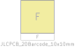    |
| `JLCPCB_2DBarcode_5x5mm`      | 2D barcode (5 × 5 mm) placeholder for JLCPCB                 |       |
| `JLCPCB_2DBarcode_8x8mm`      | 2D barcode (8 × 8 mm) placeholder for JLCPCB                 |       |
| `JLCPCB_OrderNumber_H0.8mm`   | Order number placeholder (0.8 mm text) for JLCPCB            |    |
| `JLCPCB_SerialNumber_2x10mm`  | Number only serial number (2 × 10 mm) placeholder for JLCPCB |   |
| `PCBWay_ProductNumber_H0.8mm` | Order number placeholder (0.8 mm text) for JLCPCB            |  |

## `LKBD_PlateMX.pretty`

| Footprint                 | Description                                                               | Preview                                                                                                     |
|---------------------------|---------------------------------------------------------------------------|-------------------------------------------------------------------------------------------------------------|
| `Plate_MX_1.25U`          | Plate cutout for Cherry MX style keyswitches (1.25U)                      |           |
| `Plate_MX_1.5U`           | Plate cutout for Cherry MX style keyswitches (1.5U)                       |            |
| `Plate_MX_1.75U`          | Plate cutout for Cherry MX style keyswitches (1.75U)                      |           |
| `Plate_MX_1U`             | Plate cutout for Cherry MX style keyswitches (1U)                         |              |
| `Plate_MX_2.25U`          | Plate cutout for Cherry MX style keyswitches (2.25U)                      |           |
| `Plate_MX_2.25U_1.25U+1U` | Plate cutout for Cherry MX style keyswitches (2.25U or 1.25U + 1U)        |  |
| `Plate_MX_2.25U_1U+1.25U` | Plate cutout for Cherry MX style keyswitches (2.25U or 1U + 1.25U)        |  |
| `Plate_MX_2.5U`           | Plate cutout for Cherry MX style keyswitches (2.5U)                       |            |
| `Plate_MX_2.75U`          | Plate cutout for Cherry MX style keyswitches (2.75U)                      |           |
| `Plate_MX_2U`             | Plate cutout for Cherry MX style keyswitches (2U)                         |              |
| `Plate_MX_2U_2x1U`        | Plate cutout for Cherry MX style keyswitches (2U or 2 × 1U)               |         |
| `Plate_MX_3U`             | Plate cutout for Cherry MX style keyswitches (3U)                         |              |
| `Plate_MX_4x1U_2x1.5U+1U` | Plate cutout for Cherry MX style keyswitches (4 × 1U or 1.5U + 1U + 1.5U) |  |
| `Plate_MX_6.25U`          | Plate cutout for Cherry MX style keyswitches (6.25U)                      |           |
| `Plate_MX_6U_Centered`    | Plate cutout for Cherry MX style keyswitches (6U, Centered)               |     |
| `Plate_MX_7U`             | Plate cutout for Cherry MX style keyswitches (7U)                         |              |
| `Plate_MX_8U`             | Plate cutout for Cherry MX style keyswitches (8U)                         |              |

## `LKBD_StabMX.pretty`

| Footprint             | Description                                                          | Preview                                                                                                |
|-----------------------|----------------------------------------------------------------------|--------------------------------------------------------------------------------------------------------|
| `Stabilizer_MX_2U`    | Stabilizer for Cherry MX style keyswitches (2U, 2.25U, 2.5U & 2.75U) | 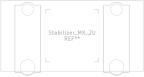    |
| `Stabilizer_MX_3U`    | Stabilizer for Cherry MX style keyswitches (3U)                      |     |
| `Stabilizer_MX_6.25U` | Stabilizer for Cherry MX style keyswitches (6.25U)                   |  |
| `Stabilizer_MX_6U`    | Stabilizer for Cherry MX style keyswitches (6U)                      | 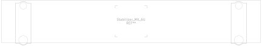    |
| `Stabilizer_MX_7U`    | Stabilizer for Cherry MX style keyswitches (7U)                      |     |
| `Stabilizer_MX_8U`    | Stabilizer for Cherry MX style keyswitches (8U)                      |     |
