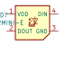
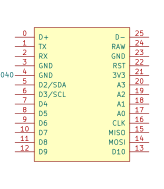
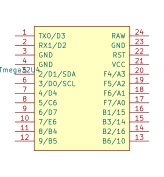

# LKBD Symbols

## `LKBD_LED.kicad_sym`

| Symbol         | Description                          | Links                                                                                        | Preview                                                                                            |
|----------------|--------------------------------------|----------------------------------------------------------------------------------------------|----------------------------------------------------------------------------------------------------|
| `SK6812MINI-E` | SK6812MINI-E Reverse Mounted RGB LED | [Datasheet](https://cdn-shop.adafruit.com/product-files/4960/4960_SK6812MINI-E_REV02_EN.pdf) |  |

## `LKBD_MCU.kicad_sym`

| Symbol                | Description                   | Links                                                                                                                                                                                                  | Preview                                                                                                   |
|-----------------------|-------------------------------|--------------------------------------------------------------------------------------------------------------------------------------------------------------------------------------------------------|-----------------------------------------------------------------------------------------------------------|
| `KB2040`              | Adafruit KB2040               | [Datasheet](https://cdn-learn.adafruit.com/downloads/pdf/adafruit-kb2040.pdf), [Pinout](https://raw.githubusercontent.com/adafruit/Adafruit-KB2040-PCB/refs/heads/main/Adafruit%20KB2040%20Pinout.pdf) |               |
| `ProMicro_ATmega32U4` | Sparkfun Pro Micro ATmega32U4 | [Datasheet](https://cdn.sparkfun.com/datasheets/Dev/Arduino/Boards/ProMicro16MHzv1.pdf)                                                                                                                |  |
| `ProMicro_RP2040`     | Sparkfun Pro Micro RP2040     | [Datasheet](https://cdn.sparkfun.com/assets/e/2/7/6/b/ProMicroRP2040_Graphical_Datasheet.pdf)                                                                                                          |      |
| `XIAO-RP2040`         | SeeedStudio XIAO RP2040       | [Documentation](https://wiki.seeedstudio.com/XIAO-RP2040/), [Pinout](https://files.seeedstudio.com/wiki/XIAO-RP2040/img/xinpin.jpg)                                                                    |          |

## `LKBD_OpticalSensor.kicad_sym`

| Symbol           | Description                          | Links                                                                                                   | Preview                                                                                                        |
|------------------|--------------------------------------|---------------------------------------------------------------------------------------------------------|----------------------------------------------------------------------------------------------------------------|
| `PMW3360DM-T2QU` | PixArt PMW3360DM-T2QU Optical Sensor | [Datasheet](https://www.epsglobal.com/Media-Library/EPSGlobal/Products/files/pixart/PMW3360DM-T2QU.pdf) |  |

