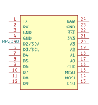
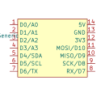
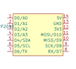
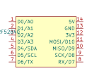

<!-- This file is generated using `scripts/gen-sym-doc.py`, do not edit manually. -->
<!-- markdownlint-disable MD045 MD033 -->
# LKBD Symbols

## `LKBD_Connector.kicad_sym`

| Symbol                | Description                                                  | Links                                                                     | Preview                                                                                                         |
|-----------------------|--------------------------------------------------------------|---------------------------------------------------------------------------|-----------------------------------------------------------------------------------------------------------------|
| `Conn_Grove_Analog`   | Grove Analog Connector                                       | [Documentation](https://wiki.seeedstudio.com/Grove_System/#grove-analog)  |    |
| `Conn_Grove_Digital`  | Grove Digital Connector                                      | [Documentation](https://wiki.seeedstudio.com/Grove_System/#grove-digital) |   |
| `Conn_Grove_I2C`      | Grove I2C Connector (Compatible STEMMA 4Pin)                 | [Documentation](https://wiki.seeedstudio.com/Grove_System/#grove-i2c)     |       |
| `Conn_Grove_UART`     | Grove UART Connector                                         | [Documentation](https://wiki.seeedstudio.com/Grove_System/#grove-uart)    |      |
| `Conn_PimoroniBG_I2C` | Pimoroni Breakout Garden I2C Connector                       | [Documentation](https://github.com/pimoroni/breakout-garden)              |  |
| `Conn_PimoroniBG_SPI` | Pimoroni Breakout Garden SPI Connector                       | [Documentation](https://github.com/pimoroni/breakout-garden)              |  |
| `Conn_Qwiic_I2C`      | StemmaQT / Qwiic I2C Connector                               | [Documentation](https://www.sparkfun.com/qwiic)                           |       |
| `PINHD_1x03_ARGB`     | Adressable RGB LED Pin Header for WS2812B style LED strips   |                                                                           |      |
| `PINHD_1x04_I2C`      | Generic I2C Pin Header                                       |                                                                           |       |
| `PINHD_1x04_I2C_OLED` | OLED I2C Pin Header for SSD1107, SSD1306 and SH1107 displays |                                                                           |  |
| `PINHD_1x05_I2C`      | Generic I2C Pin Header with 1 extra IO pin                   |                                                                           |       |
| `PINHD_1x06_I2C`      | Generic I2C Pin Header with 2 extra IO pins                  |                                                                           |       |

## `LKBD_LED.kicad_sym`

| Symbol         | Description                          | Links                                                                                        | Preview                                                                                            |
|----------------|--------------------------------------|----------------------------------------------------------------------------------------------|----------------------------------------------------------------------------------------------------|
| `SK6812MINI-E` | SK6812MINI-E Reverse Mounted RGB LED | [Datasheet](https://cdn-shop.adafruit.com/product-files/4960/4960_SK6812MINI-E_REV02_EN.pdf) |  |

## `LKBD_MCU.kicad_sym`

| Symbol                | Description                                   | Links                                                                                                                                                                                                  | Preview                                                                                                   |
|-----------------------|-----------------------------------------------|--------------------------------------------------------------------------------------------------------------------------------------------------------------------------------------------------------|-----------------------------------------------------------------------------------------------------------|
| `KB2040`              | Adafruit KB2040                               | [Datasheet](https://cdn-learn.adafruit.com/downloads/pdf/adafruit-kb2040.pdf), [Pinout](https://raw.githubusercontent.com/adafruit/Adafruit-KB2040-PCB/refs/heads/main/Adafruit%20KB2040%20Pinout.pdf) |               |
| `ProMicro_ATmega32U4` | Sparkfun Pro Micro ATmega32U4                 | [Datasheet](https://cdn.sparkfun.com/datasheets/Dev/Arduino/Boards/ProMicro16MHzv1.pdf)                                                                                                                |  |
| `ProMicro_RP2040`     | Sparkfun Pro Micro RP2040                     | [Datasheet](https://cdn.sparkfun.com/assets/e/2/7/6/b/ProMicroRP2040_Graphical_Datasheet.pdf)                                                                                                          |      |
| `RP2040-Zero`         | Waveshare RP2040-Zero                         | [Documentation](https://www.waveshare.com/wiki/RP2040-Zero), [Pinout](https://www.waveshare.com/w/upload/2/2b/RP2040-Zero-details-7.jpg)                                                               |          |
| `XIAO_Generic`        | Generic SeeedStudio XIAO (Common Pins)        | [Documentation](https://wiki.seeedstudio.com/SeeedStudio_XIAO_Series_Introduction/)                                                                                                                    |         |
| `XIAO_nRF52840_BAT`   | SeeedStudio XIAO nRF52840 (with Battery pins) | [Documentation](https://wiki.seeedstudio.com/XIAO_BLE/), [Pinout](https://files.seeedstudio.com/wiki/XIAO-BLE/pinout2.png)                                                                             |    |
| `RP2040-Tiny`         | Waveshare RP2040-Tiny                         | [Documentation](https://www.waveshare.com/wiki/RP2040-Tiny), [Pinout](https://www.waveshare.com/w/upload/f/f2/RP2040-Tiny-Kit-details-11.png)                                                          |          |
| `XIAO_RP2040`         | SeeedStudio XIAO RP2040                       | [Pinout](https://files.seeedstudio.com/wiki/XIAO-RP2040/img/xinpin.jpg), [Documentation](https://wiki.seeedstudio.com/XIAO-RP2040/)                                                                    |          |
| `XIAO_nRF52840`       | SeeedStudio nRF52840                          | [Pinout](https://files.seeedstudio.com/wiki/XIAO-BLE/pinout2.png), [Documentation](https://wiki.seeedstudio.com/XIAO_BLE/)                                                                             |        |

## `LKBD_OpticalSensor.kicad_sym`

| Symbol           | Description                          | Links                                                                                                   | Preview                                                                                                        |
|------------------|--------------------------------------|---------------------------------------------------------------------------------------------------------|----------------------------------------------------------------------------------------------------------------|
| `PMW3360DM-T2QU` | PixArt PMW3360DM-T2QU Optical Sensor | [Datasheet](https://www.epsglobal.com/Media-Library/EPSGlobal/Products/files/pixart/PMW3360DM-T2QU.pdf) |  |
